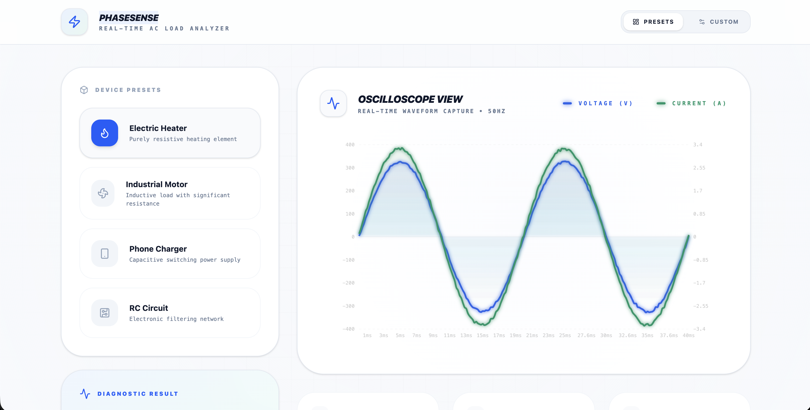
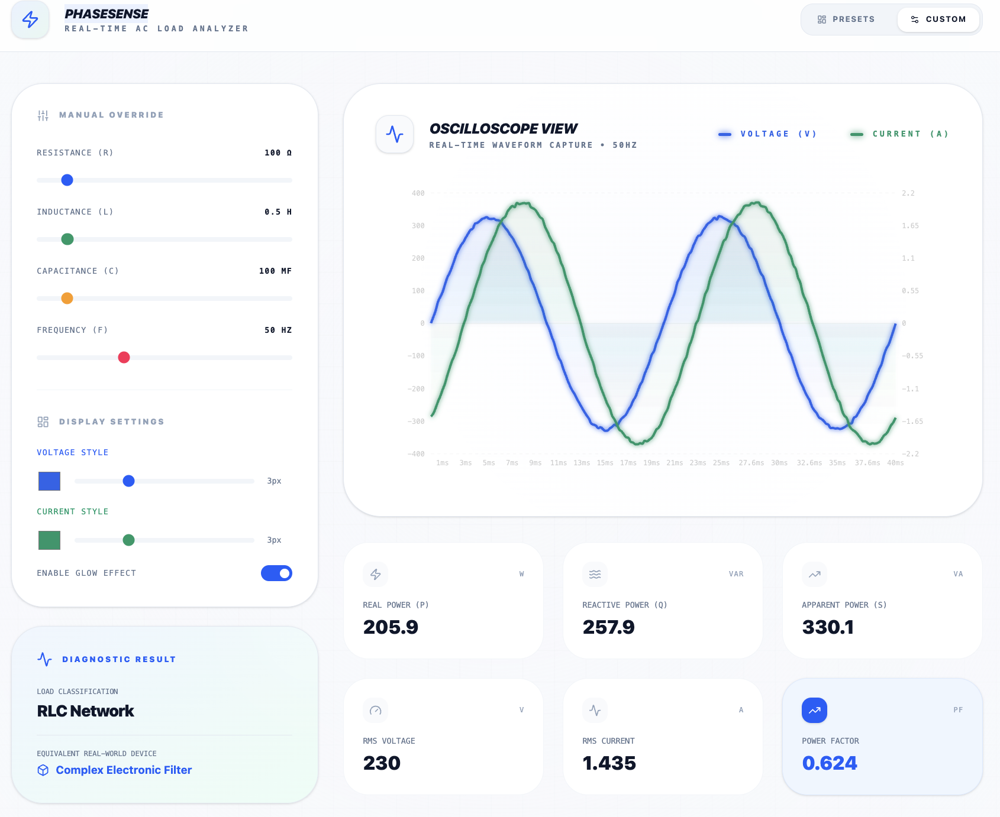

# PhaseSense — Real-Time AC Load Analyzer

<div align="center">
  
</div>
<div align="center">
  
</div>

A professional AC Load Analyzer for real-time impedance identification, power metrics, and phasor analysis. This interactive web application simulates various AC electrical loads and provides comprehensive analysis of their electrical characteristics.

## Features

- **Real-Time Simulation**: Interactive simulation of AC voltage and current waveforms
- **Load Presets**: Pre-configured electrical loads including:
  - Electric Heater (resistive)
  - Industrial Motor (inductive)
  - Phone Charger (capacitive)
  - RC Circuit (complex impedance)
- **Waveform Visualization**: Live charts showing voltage and current waveforms using Recharts
- **Phasor Diagrams**: Visual representation of voltage and current phasors with D3.js
- **Power Analysis**: Real-time calculation of:
  - Active Power (P)
  - Reactive Power (Q)
  - Apparent Power (S)
  - Power Factor
  - Phase Angle
- **Impedance Control**: Adjustable resistance (R), inductance (L), and capacitance (C) parameters
- **Frequency Selection**: Support for 50Hz and 60Hz AC systems
- **Responsive Design**: Built with Tailwind CSS for modern, mobile-friendly interface

<div align="center">
  
</div>
## Technologies Used

- **Frontend**: React 19 with TypeScript
- **Build Tool**: Vite
- **Styling**: Tailwind CSS
- **Charts**: Recharts for waveform visualization
- **Graphics**: D3.js for phasor diagrams
- **Icons**: Lucide React
- **Animations**: Motion (Framer Motion)

## Installation

1. **Prerequisites**: Node.js (version 16 or higher)

2. **Clone the repository**:
   ```bash
   git clone <repository-url>
   cd phasesense—real-time-ac-load-analyzer
   ```

3. **Install dependencies**:
   ```bash
   npm install
   ```

## Usage

1. **Start the development server**:
   ```bash
   npm run dev
   ```

2. **Open your browser** and navigate to `http://localhost:3000`

3. **Interact with the application**:
   - Select a load preset from the dropdown
   - Adjust R, L, C values using the sliders
   - Change frequency (50Hz/60Hz)
   - Observe real-time waveform updates and power calculations

## Available Scripts

- `npm run dev` - Start development server
- `npm run build` - Build for production
- `npm run preview` - Preview production build
- `npm run clean` - Clean build directory
- `npm run lint` - Run TypeScript type checking

## Project Structure

```
src/
├── App.tsx          # Main application component
├── main.tsx         # Application entry point
└── index.css        # Global styles
```

## Educational Purpose

This project was developed as a college project to demonstrate concepts in electrical engineering, specifically AC circuit analysis, power systems, and impedance calculations. It serves as an interactive learning tool for understanding:

- AC circuit behavior
- Phasor analysis
- Power factor correction
- Load characteristics
- Real-time data visualization

## Contributing

Contributions are welcome! Please feel free to submit a Pull Request.

## License

This project is licensed under the Apache-2.0 License - see the LICENSE file for details.
